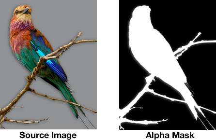

# Transparent JPEG Images on iOS

When you distribute images with your app you usually pick the PNG or JPEG format. The advantage of JPEG is that it compresses much better than PNG, especially for photos. The downside is that JPEG images cannot have transparency. But with a little trick we can create a transparent image from a JPEG anyway.

The transparency in a PNG file comes from the so-called "alpha channel". For every pixel not only red, green and blue values are stored but also an "alpha" value that determines how transparent that pixel is. A value of 255 means this pixel is fully opaque, 0 is fully transparent, and anything in between will mix the pixel's RGB values with the underlying color.

By saving a JPEG image not as one but as two image files you can still have transparent images. The first image is the regular JPEG with as much compression as you can get away with, the second image is the alpha channel. This is a grayscale image with black representing fully transparent, white fully opaque, and gray everything in between.

You can combine these two images at runtime to make the image transparent again. Because of the JPEG compression the resulting image loses a little bit of clarity but if you tweak the compression settings you can usually get away with it.

Using the `mh_combineWithAlphaImage:backgroundColor:` method from the `UIImage` category in this project, you can combine the JPEG source image with a second image that contains only an alpha channel, to create an image that does have transparency.

This project includes a simple app with some sample images to demonstrate how this works.

### Preparing your images

Your workflow should be as follows:

1. Export your image from Photoshop as a PNG with transparency.

2. Export the image again as a JPEG, using suitable compression settings. The background should have a solid color, typically white or black but any color will do.

3. Save the alpha channel to a separate JPEG or PNG image. I couldn't find an easy way to do this from Photoshop, but the [ImageMagick](http://www.imagemagick.org/) tool can do it without problems.

Extracting the alpha channel is very easy using the ImageMagick command line tool. If you have ImageMagick installed, open a Terminal and go to the folder that contains the exported PNG image. Then type:
    
    convert -alpha Extract -type optimize -strip -quality 60 +dither Source.png Alpha.jpg

This extracts the alpha channel from the PNG image and saves it as a JPEG file. You can tweak the level of compression with the `-quality` parameter.

Note: The alpha image does not have to be a JPEG, it can also be a PNG file. If it is a JPEG then it can have different quality/compression settings from the main image. 

If you specify "Alpha.png" instead of "Alpha.jpg", ImageMagick saves the alpha channel as a grayscale PNG-8 file. You should use whichever one makes the smallest file size.

The source and alpha images must always have the same dimensions.

### Combining the images

4. Add the two images -- the non-transparent source image and the alpha channel -- to the app.

5. At some point, call the `mh_combineWithAlphaImage:backgroundColor:` method to combine these two images into a new, transparent, image.

6. Your app probably should save the combined image to the Caches folder so you don't have to do this again.

That's it, quite easy.

### Some notes

The current implementation works well but is not as fast as it could be. It also uses more memory than is strictly necessary. I might rewrite this at some point to use the Accelerate framework or Core Image.

Not all images compress better as JPEG. You should use JPEG only where it makes sense.

Credits: _Bird image by [Sias van Schalkwyk](http://www.sxc.hu/photo/1362219)_

The source code is copyright 2011-2014 Matthijs Hollemans and is licensed under the terms of the MIT license.
